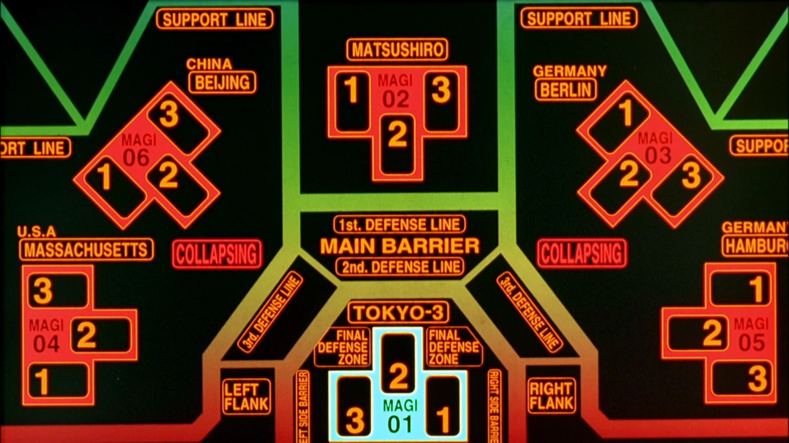

# Magi Decision Network



## Overview
The Magi Decision Network is a recursive trinary decision tree system inspired by the MAGI supercomputers from Evangelion. It implements a hierarchical decision-making process where decisions are made through majority voting at each level.

## Features
- Recursive trinary decision tree structure
- Configurable network depth using levels
- Three distinct decision makers (Balthazar, Casper, Melchior)
- Majority-based decision making
- ASCII tree visualization of the decision process

## Implementation Status
Currently, the decision makers (Balthazar, Casper, and Melchior) use random boolean values for testing purposes. 
The next step is to integrate OpenAI's API to provide actual decision-making capabilities based on the input queries.
Each machine will have a different prompt prelude that incorporates a personality aspect to add some variance to the responses.
Ultamitely, it will have a structured json response that's a bool.


## Installation
```bash
git clone <repository-url>
cd magi-network
pip install .
```

## Usage
Run the program using the following command:
```bash
python src/main.py "Your query text" -l <level>
```

Arguments:
- `"Your query text"`: The input query to process
- `-l, --level`: The depth of the decision tree (default: 1)

Example:
```bash
python src/main.py "Should I deploy to production?" -l 2
```

## Architecture

### Components
1. **MagiNetwork**: The main recursive decision tree structure
   - Creates a network of depth `level`
   - Manages decision propagation through the tree
   - Implements majority voting at each node

2. **Magi**: A leaf node containing three Machina
   - Contains Balthazar, Casper, and Melchior
   - Implements majority voting among the three machines

3. **Machina**: Base decision-making units
   - **Balthazar**: First decision maker
   - **Casper**: Second decision maker
   - **Melchior**: Third decision maker

### Decision Flow
1. Query is propagated down the tree to all nodes
2. Leaf nodes (Magi) collect decisions from their three Machina
3. Non-leaf nodes collect decisions from their three child nodes
4. Decisions are aggregated upward using majority voting
5. Final decision is made at the root node

## Tree Visualization
The program generates an ASCII tree visualization showing:
- Network structure and hierarchy
- Object IDs for each component
- Decision results at each node
- Individual machine decisions

Example output:

```
.../magi-gpt/src/main.py Is life worth it? -l 3 

Query: Is life worth it?

3 levels of decision making
27 decision makers
1 trials

Decision Tree Structure:
MagiNetwork(L3) 0x101fb4da0 -> True
├── MagiNetwork(L2) 0x100ccbe00 -> True
├── ├── MagiNetwork(L1) 0x101fdf2c0 -> True
├── ├── └── Magi 0x101fdf3e0 -> True
├── ├── └── ├── Balthazar 0x101fdf410 -> True
├── ├── └── ├── Casper 0x101fdf3b0 -> True
├── ├── └── ├── Melchior 0x101fdf380 -> True
├── ├── MagiNetwork(L1) 0x101fdf350 -> False
├── ├── └── Magi 0x101fdf320 -> False
├── ├── └── ├── Balthazar 0x101fdf4a0 -> False
├── ├── └── ├── Casper 0x101fdf2f0 -> False
├── ├── └── ├── Melchior 0x101fdf230 -> False
├── └── MagiNetwork(L1) 0x101fdf470 -> True
├── └── └── Magi 0x101fdf6e0 -> True
├── └── └── ├── Balthazar 0x101fdf590 -> False
├── └── └── ├── Casper 0x101fdf5c0 -> True
├── └── └── ├── Melchior 0x101fdf5f0 -> True
├── MagiNetwork(L2) 0x101fdf290 -> False
├── ├── MagiNetwork(L1) 0x101fdf560 -> False
├── ├── └── Magi 0x101fdf500 -> False
├── ├── └── ├── Balthazar 0x101fdf650 -> False
├── ├── └── ├── Casper 0x101fdf530 -> False
├── ├── └── ├── Melchior 0x101fdf680 -> True
├── ├── MagiNetwork(L1) 0x101fdf6b0 -> False
├── ├── └── Magi 0x101fdf4d0 -> False
├── ├── └── ├── Balthazar 0x101fdf710 -> False
├── ├── └── ├── Casper 0x101fdf740 -> False
├── ├── └── ├── Melchior 0x101fdf770 -> False
├── └── MagiNetwork(L1) 0x101fdf7a0 -> False
├── └── └── Magi 0x101fdf7d0 -> False
├── └── └── ├── Balthazar 0x101fdf800 -> False
├── └── └── ├── Casper 0x101fdf830 -> True
├── └── └── ├── Melchior 0x101fdf860 -> False
└── MagiNetwork(L2) 0x101fdf620 -> True
└── ├── MagiNetwork(L1) 0x101fdf890 -> False
└── ├── └── Magi 0x101fdf8f0 -> False
└── ├── └── ├── Balthazar 0x101fdf920 -> False
└── ├── └── ├── Casper 0x101fdf950 -> True
└── ├── └── ├── Melchior 0x101fdf980 -> False
└── ├── MagiNetwork(L1) 0x101fdf9b0 -> True
└── ├── └── Magi 0x101fdf9e0 -> True
└── ├── └── ├── Balthazar 0x101fdfa10 -> True
└── ├── └── ├── Casper 0x101fdfa40 -> True
└── ├── └── ├── Melchior 0x101fdfa70 -> True
└── └── MagiNetwork(L1) 0x101fdfaa0 -> True
└── └── └── Magi 0x101fdfad0 -> True
└── └── └── ├── Balthazar 0x101fdfb00 -> True
└── └── └── ├── Casper 0x101fdfb30 -> True
└── └── └── ├── Melchior 0x101fdfb60 -> True


Final Result: True

Requests:
3 levels of decision making
27 decision makers
1 trial

Time Elapsed:
6.1e-05 s
0.061 ms
61.0 µs
61000.0 ns

Process finished with exit code 0

```

